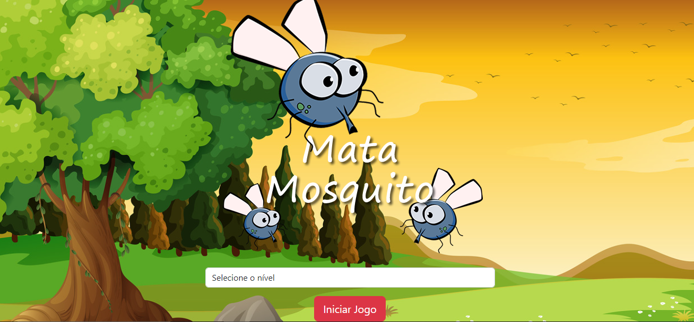
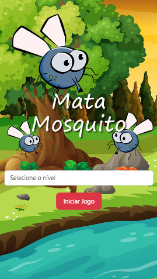
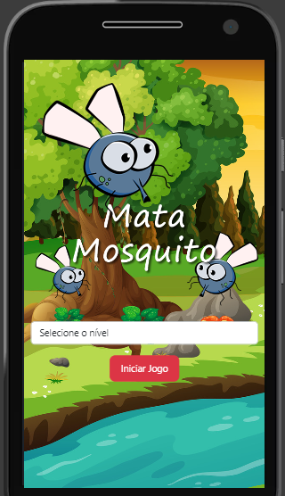

<h1 align="center"> Mata Mosquito </h1>

Esse projeto é a de um jogo baseado em moscas/mosquito que tem muito no verão aqui na casa dessas pessoas queridas
ao qual eu coloquei seus nomes para diferenciar os niveis disponiveis.

  <a href="#-tecnologias">Tecnologias</a>&nbsp;&nbsp;&nbsp;|&nbsp;&nbsp;&nbsp;
  <a href="#-projeto">Projeto</a>&nbsp;&nbsp;&nbsp;
  

  
  

 

  

## 🚀 Tecnologias

Esse projeto foi desenvolvido com as seguintes tecnologias:

- HTML e CSS
- JavaScript
- Git e Github

## 💻 Projeto

O projeto é para poder mostrar meu desenvolvimento com a criação de aplicativos tanto web como mobile.

## Contato

---

Feito com ♥ by Osni Gilberto :wave: [Acesse meu LinkedIn!](https://www.linkedin.com/in/osnigilbertojunior/)
